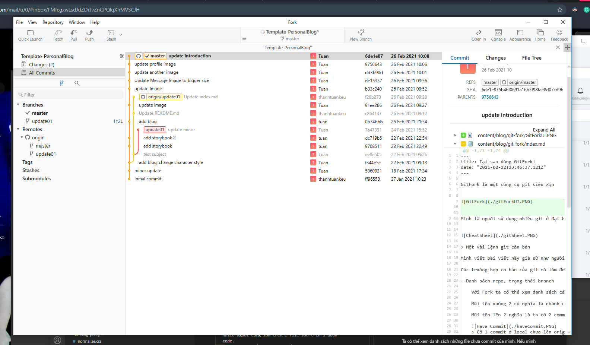
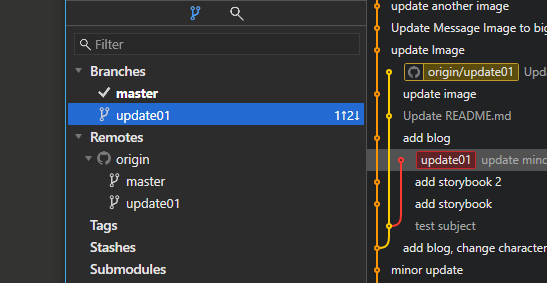
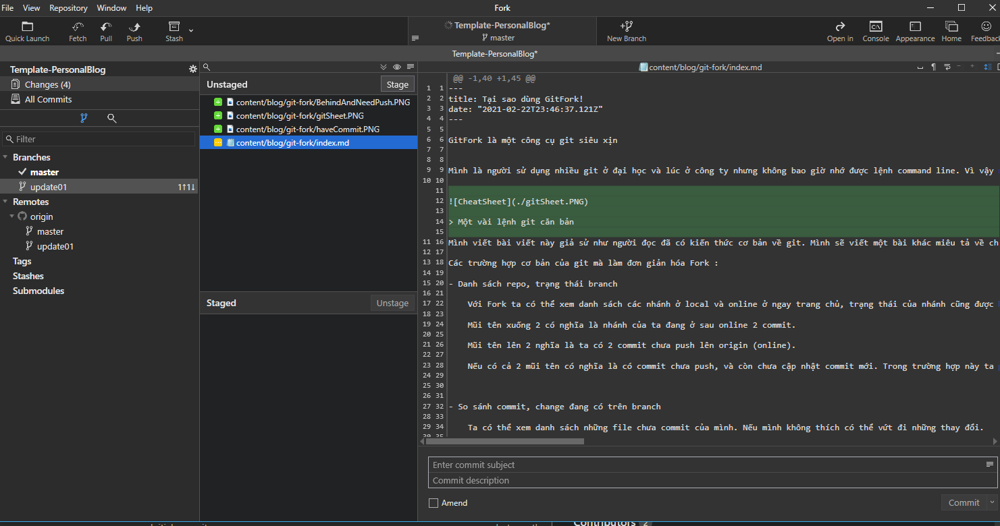
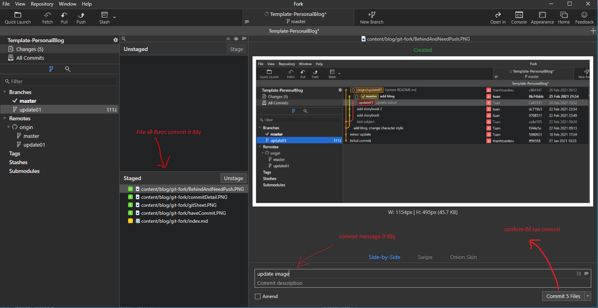
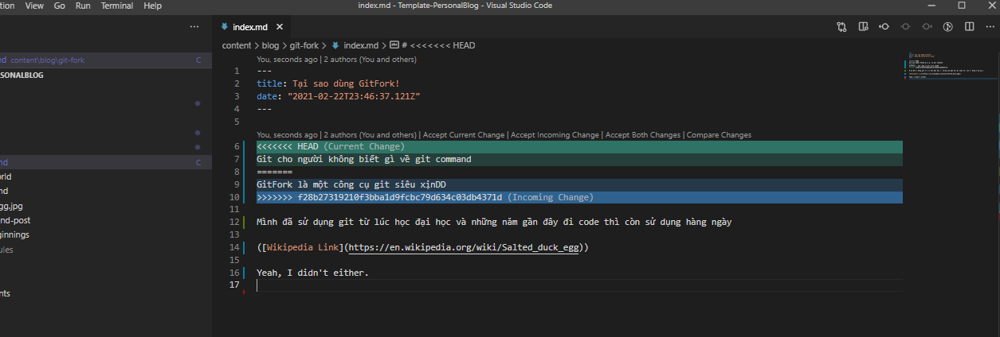
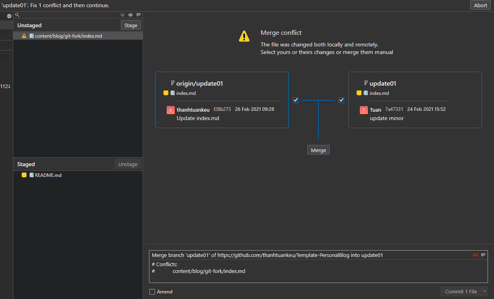
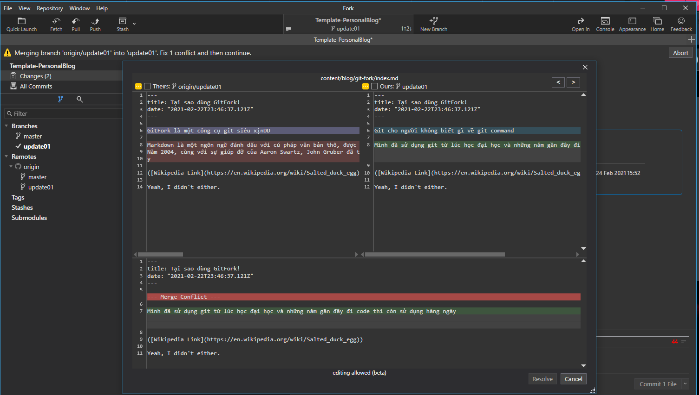

GitFork là một công cụ git siêu xịn

Mình là người sử dụng nhiều git ở đại học và lúc ở công ty nhưng không bao giờ nhớ được lệnh command line. Vì vậy nên mình đã sử dụng phần mềm git GUI để dễ hình dung và dùng git một cách thành thạo (theo hướng UI 😉 ). Trước git fork mình đã sử dụng git kraken hơn 4 năm, nhưng thời gian gần đây git kraken không còn cho phép sử dụng repository private miễn phí nữa nên mình đã chuyển sang sử dụng git Fork.

> Một vài lệnh git căn bản

Mình viết bài viết này giả sử như người đọc đã có kiến thức cơ bản về git. Mình sẽ viết một bài khác miêu tả về chi tiết về git sau.

Các trường hợp cơ bản của git mà làm đơn giản hóa Fork :

- Danh sách repo, trạng thái branch

    Với Fork ta có thể xem danh sách các nhánh ở local và online ở ngay trang chủ, trạng thái của nhánh cũng được hiển thị ở ngay trên nhánh.

    Mũi tên xuống 2 có nghĩa là nhánh của ta đang ở sau online 2 commit.

    Mũi tên lên 2 nghĩa là ta có 2 commit chưa push lên origin (online).
    
    
    > Có 1 commit ở local chưa lên origin

    Nếu có cả 2 mũi tên có nghĩa là có commit chưa push, và còn chưa cập nhật commit mới. Trong trường hợp này ta phải pull về trước khi có thể push. Nếu có conflict thì phải xử lý, git fork giúp xử lý conflict rất dễ dàng mà không cần mở editor.

    
    > Có 1 commit ở local chưa lên origin và 1 commit chưa được pull về

     

- So sánh commit, change đang có trên branch

    Ta có thể xem danh sách những file chưa commit của mình. Nếu mình không thích có thể vứt đi những thay đổi.

    
    > Có 1 commit ở local chưa lên origin và 1 commit chưa được pull về

- Pull, push commit

    Thay vì lệnh git pull, git push thì ta có thể làm nhanh hơn với 2 nút push, pull

    
    > tạo commit chuẩn bị push lên nhánh

- Solve git conflict
   Khi làm cùng team thì git conflict là điều khó tránh khỏi, trường hợp hay gặp nhất là 1 hoặc nhiều người cùng làm trên 1 file sửa trên 1 đoạn code.
   Khi điều này xảy ra git sẽ để người dùng quyết định nên giữ đoạn nào.

    
    > lúc conflict thì phải giải quyết bằng editor. 

    

    
    > Fork giúp ta nhìn rõ hơn file nào đang conflict.  
    
    
    > Sửa conflict ngay trên APP.

- checkout commit, reset branch

    Nếu như cách cũ thì muốn check out 1 commit trước thì bạn phải có commit id rồi mới có thể checkout, với fork bạn có thể xem lịch sử và double click để checkout. Đơn giản qua 2 bước

Bên trên là những cái cơ bản của git nhưng để nhớ hết tất cả các lệnh command line hoặc dùng git khác như tortoire thì rất khó nhớ, hình dùng. Fork là git GUI ưa thich mới của mình. Nếu các bạn cũng có khó khăn sử dụng git hoặc muốn đổi gió thì hãy thử sử dụng phiên bản App .